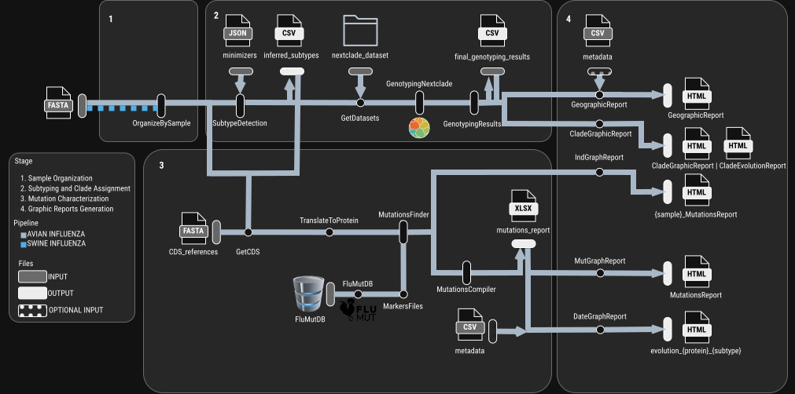
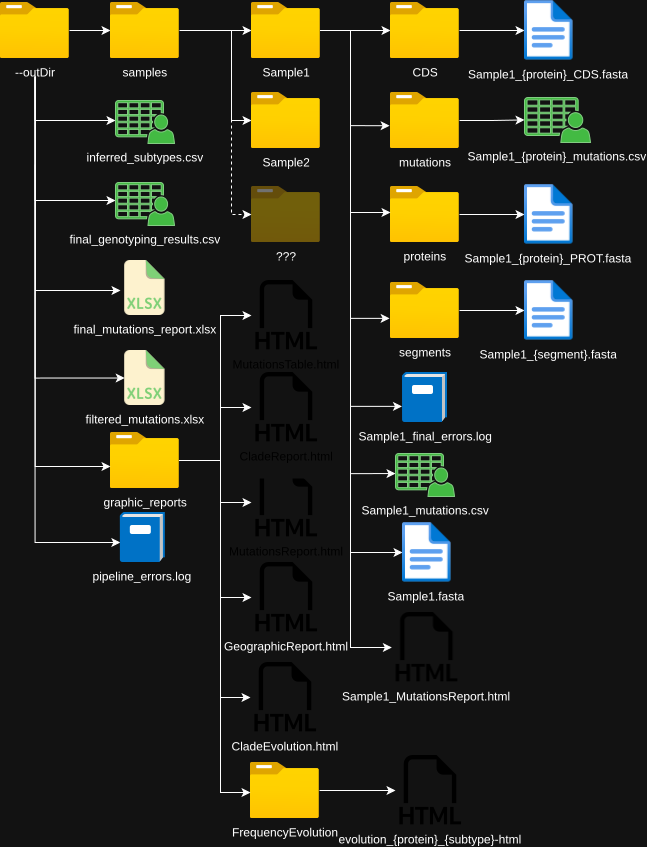

# FluTyper 🧬🐔🐷
[](https://code.askimed.com/nf-test)

FluTyper is a modular, reproducible Nextflow pipeline for genotyping influenza viruses (avian and human) and characterizing relevant mutations. It is designed for genomic surveillance, research, and integration within a **One Health** framework.

---

## 📑 Table of Contents

- [✨ Features](#-features)
- [🚀 Quick Start](#-quick-start)
  - [Installation](#installation)
  - [Basic Execution](#basic-execution)
  - [Advanced Execution](#advanced-execution)
- [📥 Input Data Preparation](#-input-data-preparation)
  - [FASTA Headers](#fasta-headers)
  - [Metadata CSV (Optional)](#metadata-csv-optional)
- [🛠️ Command-Line Parameters](#️-command-line-parameters)
- [🔬 Advanced Configuration & Behaviors](#-advanced-configuration--behaviors)
  - [Continuous Monitoring (Append Mode)](#continuous-monitoring-append-mode)
  - [Threshold Parameter Behavior](#threshold-parameter-behavior)
  - [HUMAN Protocol Notes](#human-protocol-notes)
  - [Integrating Extra Markers](#integrating-extra-markers)
  - [Phylogenetics Module (Optional)](#phylogenetics-module-optional)
- [🔄 Pipeline Architecture](#-pipeline-architecture)
- [🔢 Standardized Cross-Subtype Numbering](#-standardized-cross-subtype-numbering)
- [📂 Outputs](#-outputs)
  - [Core Data Files](#core-data-files)
  - [Interactive HTML Reports](#interactive-html-reports)
  - [Excel Data Schema](#excel-data-schema-final_mutations_reportxlsx)
- [🧪 Testing & Continuous Integration](#-testing--continuous-integration)
- [🧩 Dependencies & Acknowledgments](#-dependencies--acknowledgments)
- [📖 Citation](#-citation)

---

## ✨ Features

* Automated organization of input samples and extraction of individual segments.
* Subtype detection (H/N typing and pathotype inference) from sequence data.
* Reference dataset selection and download based on detected subtypes.
* Genotyping using Nextclade with per-sample and merged reports.
* Extraction of coding sequences (CDS) and translation to protein sequences.
* Mutation detection and annotation with standardized cross-subtype numbering (optional, configurable).
* Aggregate, per-sample, and time-series HTML mutation reports compiled into a single `index.html` interactive dashboard.
* Deep linkage of markers, allowing you to click a marker to open its frequency evolution automatically.
* Continuous surveillance support via an `--append` mode for longitudinal tracking without reprocessing old data.
* Comprehensive error reporting and logging.
* Support for avian and human influenza workflows (SWINE protocol is still in development).
* Modular, reproducible workflow built with Nextflow DSL2.

---

## 🚀 Quick Start

### Installation
Clone the repository to your local machine:
```bash
git clone https://github.com/ValldHebron-Bioinformatics/FluTyper.git
cd FluTyper
```
To ensure full reproducibility of the analysis and provide all necessary dependencies, a Conda environment file is included. You can set up and activate this isolated environment using the provided configuration file before running the pipeline. All software requirements and their pinned versions are listed in `FluTyper_env.yaml`.
```bash
conda env create -f FluTyper_env.yaml
conda activate FluTyper
```
### Basic Execution
Run the pipeline with your sequence data. If no parameters are provided, it defaults to the `AVIAN` protocol using the provided test dataset.
```bash
nextflow run nf_pipeline/main.nf \
    --inputFasta <path/to/input.fasta> \
    --outDir <path/to/output_directory>
```

### Advanced Execution
For a fully customized run utilizing all available features and the colorblind-friendly reporting mode:
```bash
nextflow run nf_pipeline/main.nf \
  --inputFasta <input.fasta> \
  --outDir <output_directory> \
  --protocol HUMAN \
  --extraMarkers <extra_markers.csv> \
  --metadata <metadata.csv> \
  --threshold 0.25 \
  --colorblind true \
  --IndividualReports true \
  --append <path/to/previous_results>

```

---

## 📥 Input Data Preparation

### FASTA Headers
MultiFASTA headers must use either an underscore (`_`) or a pipe (`|`) as a separator to ensure the pipeline correctly parses the sequence identity and segment.

**Format:** `{SequenceID}_{Segment}_{OptionalInformation}` or `{SequenceID}|{Segment}|{OptionalInformation}`
*   **Underscore Example:** `>Sample01_HA_2024_Spain`
*   **Pipe Example:** `>Sample01|NA|Hebei_SJ27`

### Metadata CSV (Optional)

To generate date-based frequency reports per protein and full demographic filtering, you must provide a metadata CSV file using the `--metadata` flag. The new metadata structure allows you to provide the `ID`, `DATE`, `LOCATION`, `AGE GROUP`, `SEX`, and `ORIGINATING LAB`. The `ORIGINATING LAB` field serves as an extra geographical level for deeper spatial resolution. The file requires strict headers. You have the option to include a `LOCATION` column, which is required if you intend for the `GeographicReport.nf` process to run and generate the interactive map. Please note that the entries provided for both the `LOCATION` and `ORIGINATING LAB` fields must appear in the `RESOURCES/coordenades_cat.tsv` file, which is currently only available for locations within Catalunya.

> **Note:** Coordinate data in `coordenades_cat.tsv` was originally compiled from [businessintelligence.info](https://www.businessintelligence.info/varios/longitud-latitud-pueblos-espana). Users wishing to extend geographic coverage beyond Catalunya should populate this file with entries in the same format.
> Rendering the resulting map also requires a free CARTO API key, see [Geographic Report Basemap](#geographic-report-basemap-carto-api-key) below.

```csv
ID,DATE,LOCATION,AGE GROUP,SEX,ORIGINATING LAB
Sample01,YYYY-MM-DD,Municipality Name,15-65,F,LabName
```

---

## 🛠️ Command-Line Parameters

| Parameter | Type | Default | Description |
| --- | --- | --- | --- |
| `inputFasta` | Required | `docs/fastas/prova.fasta` | Path to the input FASTA file containing your sequences. |
| `outDir` | Required | `RESULTS` | Destination directory where all pipeline results and reports will be saved. |
| `protocol` | Optional | `AVIAN` | Defines the viral protocol. Supported options are `AVIAN` and `HUMAN`. |
| `threshold` | Optional | `0.25` | Minimum mutation frequency required to report a non-marker mutation (0.0 to 1.0). |
| `extraMarkers` | Optional | *None* | Path to a custom CSV file containing specific markers to track across samples. |
| `metadata` | Optional | *None* | Path to a metadata CSV to enable time-series frequency tracking. |
| `colorblind` | Optional | `false` | Set to `true` to apply an Okabe-Ito colorblind-friendly palette to all HTML charts. |
| `IndividualReports` | Optional | `false` | Set to `true` to make the Individual genomic barcode for each sample. |
| `append` | Optional | *None* | Path to an existing results directory to integrate new data without reprocessing historical files. |
| `carto_api_key` | Optional | *None* | Free CARTO Maps API key required to render basemap tiles in the Geographic Report. Get one at [carto.com/basemaps/apikey](https://carto.com/basemaps/apikey/). Required only if a `LOCATION` column triggers `GeographicReport.nf`. |
| `phylogenetics` | Optional | `false` | Set to `true` (or pass `--phylogenetics`) to build the annotated whole-genome phylogeny of the HUMAN H3N2 samples. See [Phylogenetics Module](#phylogenetics-module-optional) for its own parameters. |
---

## 🔬 Advanced Configuration & Behaviors

### Continuous Monitoring (Append Mode)

Furthermore, an `--append` mode supports continuous monitoring by directly adding new sequencing runs to previous outputs. Because it does not require reprocessing old data, laboratories can effortlessly extend their longitudinal tracking of both viral mutations and clade distributions as new samples are collected.

### Threshold Parameter Behavior

The threshold parameter establishes a baseline frequency cutoff that impacts data visualization. This threshold value initializes the slider in the `MutationsReport.html` interactive plot, allowing users to dynamically adjust the view without needing to re-execute the pipeline. The frequency denominator used for this calculation is the number of samples containing that specific protein, rather than the total number of samples in the entire run.

### HUMAN Protocol Notes

The HUMAN protocol utilizes dedicated resources located under `protocols/HUMAN/v2` and introduces marker annotations specifically tailored to human seasonal influenza. It supports genotyping for `H1` (using Nextclade dataset `flu_h1n1pdm_ha`) and `H3` (using Nextclade dataset `flu_h3n2_ha`). Marker files are read directly from the protocol's marker directory rather than querying FluMutDB. When metadata is provided, the human protocol fully supports generating time-evolution frequency reports.

### Integrating Extra Markers

You can introduce your own mutation markers into the pipeline by supplying a structured CSV file via the `--extraMarkers` parameter. The file must strictly contain seven columns: `MARKER_ID`, `POSITION`, `AA`, `PROTEIN`, `EFFECT`, `FOUND_IN`, and `REFERENCE`. It is crucial to note that the `POSITION` value must always be specified using H5N1 numbering. Custom `MARKER_ID` values must be integers starting at 1000. Valid inputs for the `PROTEIN` column include HA1, HA2, M1, M2, NA, NP, NS-1, NS-2, PA, PB1, PB1-F2, and PB2.

You may use "X" in the `AA` column as a wildcard, which forces the pipeline to trigger the marker upon any true amino-acid change at that specific position. This is particularly useful for tracking biologically relevant epitopes regardless of the specific resulting mutation. To define a marker that requires a combination of mutations, simply assign the same `MARKER_ID` to multiple rows. For the HUMAN protocol, ensure the `FOUND_IN` column is accurately populated, as the pipeline will selectively check samples against markers that match their specific subtype context.

```csv
MARKER_ID,POSITION,AA,PROTEIN,EFFECT,FOUND_IN,REFERENCE
1000,631,L,PB2,Increased pandemic risk,H5N1,Capalastegui & Goldhill 2025
1001,141,X,HA1,RBD,H5N1 | H7N9,Luczo & Spackman 2024
```
### Geographic Report Basemap (CARTO API Key)

If your metadata includes a `LOCATION` column, the pipeline automatically triggers `GeographicReport.nf` to build an interactive map of sample distribution. As of 2026, CARTO requires a free API key to serve its basemap tiles, without one, the map renders with an "API key required" watermark instead of the actual basemap.

Getting a key is free and takes about a minute — request one at [carto.com/basemaps/apikey](https://carto.com/basemaps/apikey/). 

Pass it to the pipeline with `--carto_api_key`:
```bash
nextflow run nf_pipeline/main.nf \
  --inputFasta <input.fasta> \
  --metadata <metadata.csv> \
  --carto_api_key <your_carto_key>
```

For production or repeated runs, avoid retyping the key by keeping it in a local, gitignored config file (e.g. `secrets.config`) and layering it on top of the default config:
```groovy
// secrets.config
params.carto_api_key = 'your_carto_key'
```
```bash
nextflow run nf_pipeline/main.nf -c secrets.config --protocol AVIAN --inputFasta <input.fasta> --metadata <metadata.csv>
```
---

### Phylogenetics Module (Optional)

With `--phylogenetics`, FluTyper builds annotated maximum likelihood trees of a HUMAN run, following the method of Koumaty *et al.* (2026, see [Citation](#-citation)).

**What you get.** For each subtype present in the run (`--phyloSubtype`, default `H3N2,H1N1pdm09`), one **tree per segment** (PB2, PB1, PA, HA, NP, NA, MP, NS; `--phyloSegmentTrees`, default `all`). Each segment tree contains every sample of that subtype whose segment passes coverage QC, plus the subtype's WHO reference / vaccine strains as root tips, so a sample with a poor PB1 still appears in its HA or NA tree. Next to each tree, a heatmap shows one column per annotation: `subclade | source | period | season | age group | sex`, followed by one column per requested amino acid position on that segment (e.g. `HA1:62` on the HA tree, `NA:247` on the NA tree). The **whole-genome** tree of the paper (all 8 segments concatenated; a sample needs every segment to pass QC) is opt-in with `--phylo-whole-genome`.

| Subtype | Coordinate reference | Root strains (tips) | Outgroup |
| --- | --- | --- | --- |
| H3N2 | A/Darwin/6/2021 (PA: A/Massachusetts/18/2022) | Darwin/6/2021, Massachusetts/18/2022, Croatia/10136RV/2023, Singapore/GP20238/2024, Sydney/1359/2024 | A/Darwin/6/2021 (PA tree: A/Massachusetts/18/2022) |
| H1N1pdm09 | A/Wisconsin/67/2022 | Victoria/2570/2019, Sydney/5/2021, Wisconsin/67/2022 | A/Victoria/2570/2019 |

**Quick start.** Segment trees for both subtypes, with the amino acid positions listed in a CSV (see [below](#aa-positions-csv)):

```bash
conda activate FluTyper
nextflow run nf_pipeline/main.nf \
  --protocol HUMAN \
  --inputFasta sequences.fasta \
  --metadata metadata.csv \
  --outDir RESULTS \
  --phylogenetics \
  --aa-positions-file aa_positions.csv
```

Open `RESULTS/index.html` and go to the **Phylogenetics** section of the sidebar.

**The interactive tree report.** In the dashboard, the **Subtype** dropdown (H3N2 / H1N1pdm09) and the **Tree** dropdown (the segments that were built, plus *Whole genome* when requested) choose the tree to display. Each report has:

- the rooted tree, with tips coloured by subclade and branch lengths in substitutions per site (scale bar at the bottom);
- node labels with the ultrafast bootstrap support, shown only when ≥ `--min-support-label` (default `70`);
- the heatmap: one solid column per annotation, every cell aligned with its tip; hover over a cell for the sample and its value;
- season, age group and sex filters (from `--metadata`), which prune the tree to the matching samples while keeping the branch lengths of the full tree; reference strains are always shown;
- a legend per panel. (The static SVG/PNG version of the figure is still drawn by `PhyloReport`, but like the other intermediate files it stays in `work/` and is not published.)

**Adding a new run to previous results.** With `--append <previous outDir>`, only the new FASTA is processed, but every tree is rebuilt from the previous samples plus the new ones (see [`--append` and phylogenetics](#append-and-phylogenetics)). Add `-resume` when rerunning from the same launch directory to reuse the steps whose inputs did not change (for example, changing only report options reruns just the reports).

**Reproducing the paper's figure (H3N2 whole-genome tree, HA1 62, 145 and 239):**

```bash
nextflow run nf_pipeline/main.nf \
  --protocol HUMAN \
  --inputFasta sequences.fasta \
  --metadata metadata.csv \
  --outDir RESULTS \
  --phylogenetics \
  --phylo-subtype H3N2 \
  --phylo-whole-genome \
  --phylo-segment-trees none \
  --aa-positions HA1:62,HA1:145,HA1:239 \
  --lab-map lab_map.tsv
```

`tests/data/humanmetadata_labs.csv` and `tests/data/lab_map_cat.tsv` are ready-made examples (dummy metadata whose originating labs come from `RESOURCES/coordenades_cat.tsv`, grouped into a hospital vs community split).

**Steps.** The analysis is the `PHYLOGENETICS` subworkflow (`nf_pipeline/subworkflows/Phylogenetics.nf`), made of eight processes in `nf_pipeline/modules/phylogeny/` (plus the helper that renames reused historical Nextclade results in `--append` runs):

| Process | Method |
| --- | --- |
| `PhyloPreflight` | Stops the run if a tool or R package is missing (names it and the expected version; a different version only warns), builds the codon map of every protein on the coordinate references and validates `--aa-positions` against it. Every other step waits for it. |
| `PhyloCoverageQC` | Per sample and segment, in parallel: a segment passes when it covers ≥ `--phyloMinCoverage` (0.95) of the reference with non-N bases; missing segments and segments with several records fail. A sample enters a segment tree when that segment passes, and the whole-genome tree only when **every** segment passes. |
| `PhyloAlignment` | MAFFT `--auto` per segment against the subtype's coordinate reference, trimmed to reference columns (no manual curation), concatenated PB2, PB1, PA, HA, NP, NA, MP, NS. |
| `PhyloTree` | IQ-TREE, `--model GTR+G4`, `--bootstrap 1000` ultrafast bootstraps, `--seed`, rooted on the subtype's outgroup root strain. |
| `PhyloSubclades` | Nextclade `subclade` column (per-sample results; root strains run against the same dataset). |
| `PhyloPostTree` | TreeTime parsimony ancestral states, translated through the codon map so internal nodes carry amino acid states; TreeCluster single linkage within each subclade, `--clusterThreshold 0.005` subs/site, tips outside a cluster stay `unclustered`; amino acid changes on the branch into each cluster. |
| `PhyloReport` | `annotations.tsv`, the R/ggtree figure (SVG/PNG), the interactive `PhylogeneticTreeReport_<subtype>.html` and `run_manifest.json`. |
| `PhyloLog` | Assembles each tree's `phylo.log` from the messages of the steps above and publishes the ML tree as `tree.nwk`. |

Only `PhyloReport` depends on the figure options, so with `-resume` a change of `--aa-positions`, panels, lab map or figure size reruns the preflight check and the report but reuses the alignment, tree, ancestral states and clusters.

**Several trees, one subtype.** `PhyloPreflight`, `PhyloCoverageQC` and `PhyloSubclades` run once per subtype (coverage QC checks every segment regardless of which trees are built; subclade assignment, from HA, does not depend on the tree). `PhyloAlignment` (whole genome, `--phyloWholeGenome`) and `PhyloSegmentAlignment` (one call per requested segment, `--phyloSegmentTrees`) then each build their own alignment from the samples with full coverage of *their* segment(s) — a segment's candidate pool is usually larger than the whole-genome one. `PhyloTree`, `PhyloPostTree` and `PhyloReport` run once per tree (whole genome plus every segment tree), fanned out over one Nextflow channel so trees build in parallel (serialised for the heavy alignment/tree steps by the `big_mem` label, `maxForks = 1`). A segment tree is skipped (with a warning) when fewer than 3 samples pass coverage QC for that segment. If the configured `--phyloOutgroup` lacks a segment (H3N2 PA: A/Darwin/6/2021 has none), that segment's tree is rooted on the oldest remaining root strain instead (by the year in its name), recorded in `<SEG>_root_used.tsv`.

**Two independent subtypes.** `PHYLOGENETICS_H3N2` and `PHYLOGENETICS_H1N1PDM09` are separate invocations of the same `PHYLOGENETICS` subworkflow, gated by whether their subtype is in `--phyloSubtype`; each publishes to its own `phylogeny/<subtype>/` folder (see **Outputs** below) and its own reports.

**Amino acid positions.** `--aa-positions` (H3N2, defaults to the paper's positions `HA1:62,HA1:145,HA1:239`) and `--aa-positions-h1n1` (H1N1pdm09, *no default*: the paper is H3N2-only) each take a comma-separated list of `GENE:POS` (`HA1:62,HA1:145`) and/or bare integers, which use `--aa-gene` (default `HA1`, shared by both subtypes). Columns follow the order given; omit a subtype's flag for no amino acid columns on its tree(s). Numbering follows FluTyper's protein references (HA1 = mature HA1 numbering). Positions are checked at startup by that subtype's own `PhyloPreflight`, against its own reference translation: an out-of-range position stops the run naming the valid range, and a position with the same residue in every sample only warns. On a segment tree, only the positions on genes of that segment are shown (e.g. the HA tree shows `HA1`/`HA2` columns, the NA tree shows `NA` columns; a segment tree with none simply has no aa columns). Nextflow keeps only the last value of a repeated flag, so give several positions as one comma-separated list (or as a YAML list in a `-params-file`). Residue colours are fixed per amino acid letter, so they are identical across positions and runs. Amino acid states come from the ancestral reconstruction for internal nodes; tips keep their observed sequence, and ambiguous or missing codons are shown as `NA`.

<a id="aa-positions-csv"></a>**Amino acid positions from a CSV (`--aa-positions-file`).** Instead of `--aa-positions`/`--aa-positions-h1n1`, a CSV with (case-insensitive) `protein,position` columns and an optional `subtype` column can be given, e.g.:

```
protein,position,subtype
HA1,62,H3N2
HA1,145,H3N2
HA1,239,H3N2
NA,247,
```

A row's `subtype` (`H3N2` or `H1N1pdm09`) restricts it to that subtype's tree(s); a blank cell or a file with no `subtype` column applies the row to every requested subtype (`NA,247` above lands on both H3N2's and H1N1pdm09's NA tree). `--aa-positions-file` replaces `--aa-positions`/`--aa-positions-h1n1` (and the `aaPositions` default) only for the subtypes it actually has rows for: a subtype it never mentions keeps using its own `--aa-positions(-h1n1)` value, and FluTyper warns if those flags were also given explicitly. The file path and its resolved positions are recorded in the tree's `run_manifest.json` (kept in `work/`, see **Outputs**). A small example is at `tests/data/phylo/aa_positions_example.csv`.

**Bootstrap support labels.** Node labels on both the static figure and the interactive tree only show ultrafast bootstrap support ≥ `--minSupportLabel` (default `70`; `0` shows every value). `node_support.tsv` and the tree files always keep every value; only the drawn labels are filtered.

**Metadata.** The module reads the `--metadata` CSV used by the rest of the pipeline. Nothing is imputed: missing or unparseable values stay `NA` (grey), and reference strains never receive metadata.

| Column | Required | Used for | When absent |
| --- | --- | --- | --- |
| `ID` | Yes (if metadata is given) | Joining metadata to tree tips | — |
| `ORIGINATING_LAB` | No | **source** panel (grouped with `--lab-map`) | Panel omitted, INFO line logged |
| `DATE` (`YYYY-MM-DD`) | No | **period** panel (binned by `--period-bin`), **season** panel and the season filter of the interactive tree | Panels omitted, INFO line logged; filter disabled |
| `AGE GROUP`, `SEX` | No | **age group** / **sex** panels and filters of the interactive tree | Panels omitted, INFO line logged; filters disabled |
| `LOCATION` | No | Not used by this module | — |

The source and period panels are drawn only when their field exists and is non-missing for at least `--min-panel-coverage` (0.8) of the samples; otherwise the panel is left out, an INFO line gives the field and its coverage, the remaining panels close the gap, and the reason is recorded in the tree's `phylo.log` (and `run_manifest.json` in `work/`). The subclade panel is always drawn. A `YYYY-MM` date is placed in its month but has no week. Panels are declared in `RESOURCES/phylo_panels.tsv` (`panel`, `column`, `scale`, `required`), so adding a panel is a new row there.

**Parameters** (kebab-case also works, e.g. `--aa-positions` = `--aaPositions`):

| Parameter | Default | Description |
| --- | --- | --- |
| `phylogenetics` | `false` | Enable the module (HUMAN protocol only). |
| `phyloSubtype` | `H3N2,H1N1pdm09` | Comma-separated subtypes that each get their own tree. |
| `phyloSubtypeConfig` | see `nextflow.config` | Map of `reference` / `referenceFallback` / `rootStrains` / `outgroup` per subtype. |
| `phyloReference` | `A/Darwin/6/2021` | **H3N2 override** of `phyloSubtypeConfig.H3N2.reference`: a value here always wins for H3N2. |
| `phyloReferenceFallback` | `A/Massachusetts/18/2022` | **H3N2 override**: coordinate reference for segments missing from `phyloReference` (PA). |
| `phyloRootStrains` | Darwin/6/2021, Massachusetts/18/2022, Croatia/10136RV/2023, Singapore/GP20238/2024, Sydney/1359/2024 | **H3N2 override**: WHO reference / vaccine strains added as tips. |
| `phyloOutgroup` | `A/Darwin/6/2021` | **H3N2 override**: root strain used to root the H3N2 tree. |
| `phyloSegmentOrder` | `PB2,PB1,PA,HA,NP,NA,MP,NS` | Concatenation order (shared by every subtype). |
| `phyloWholeGenome` | `false` | Also build the whole-genome tree (reproduces Koumaty et al. 2026); off by default. |
| `phyloSegmentTrees` | `all` | Segment trees to build: `all`, `none`, or a comma-separated subset of `phyloSegmentOrder`'s segments. |
| `phyloMinCoverage` | `0.95` | Minimum coverage in every segment. |
| `model` | `GTR+G4` | IQ-TREE substitution model. |
| `bootstrap` | `1000` | Ultrafast bootstrap replicates (`0` = none, otherwise ≥ 1000). |
| `seed` | `12345` | Random seed. |
| `clusterThreshold` | `0.005` | Single-linkage cluster threshold (substitutions/site). |
| `minSupportLabel` | `70` | Minimum ultrafast bootstrap support (%) drawn as a node label (`0` shows every value). |
| `aaPositions` | `HA1:62,HA1:145,HA1:239` | H3N2 amino acid heatmap columns (the paper's positions). |
| `aaPositionsH1n1` | *None* | H1N1pdm09 amino acid heatmap columns; no default (the paper is H3N2-only). |
| `aaPositionsFile` | *None* | CSV (`protein,position[,subtype]`) of positions; replaces `aaPositions`/`aaPositionsH1n1` for the subtypes it covers. |
| `aaGene` | `HA1` | Gene for bare positions in `aaPositions` / `aaPositionsH1n1`. |
| `minPanelCoverage` | `0.8` | Minimum sample coverage for the source and period panels. |
| `labMap` | *None* | TSV `ORIGINATING_LAB<TAB>display_group` (optional header, case-insensitive match); unmapped labs become `Other`, without a map raw lab names are shown. |
| `periodBin` | `month` | `month`, `week` or `none`. |
| `width` / `height` / `dpi` | `12` / `10` / `300` | Figure size (inches) and PNG resolution. |

**Outputs.** Each requested subtype publishes to its own `<outDir>/phylogeny/<subtype>/` folder (e.g. `phylogeny/H3N2/`, `phylogeny/H1N1pdm09/`), with one subfolder per tree actually built: `whole_genome/` (only with `--phyloWholeGenome`) and `<SEG>/` for each built segment tree (e.g. `HA/`, `NA/`). Each of these folders holds exactly three files:

- `tree.nwk`: the rooted IQ-TREE maximum-likelihood tree, with the ultrafast bootstrap support as node labels and branch lengths in substitutions per site;
- `phylo.log`: that tree's log, in order: the preflight notes that apply to it (for example `A/Darwin/6/2021 has no PA segment ...` and the outgroup fallback in the PA tree), a coverage QC summary (samples in, samples dropped and why), then the messages of each step (alignment, IQ-TREE warnings, clusters, panels rendered or skipped and why, invariant-position warnings). It is also written when a later step of that tree failed, and then shows where it stopped;
- `PhylogeneticTreeReport_<subtype>.html` (whole genome) or `PhylogeneticTreeReport_<subtype>_<SEG>.html` (segment tree): the standalone interactive report. The same report is embedded in `index.html`, switchable from the Subtype and Tree dropdowns.

Everything else the module computes (alignments, IQ-TREE report, `annotations.tsv`, ancestral states, `clusters.tsv`, `cluster_mutations.tsv`, the SVG/PNG figure, `panels_status.tsv`, `run_manifest.json` with tool versions, resolved parameters, input checksums and QC outcome, and the subtype-level `phylo_coverage_qc.tsv`, `gene_map.tsv`, `aa_positions.tsv`, `reference_segments.tsv`, `root_strains.tsv`, `phylo_tool_versions.json` and `subclades.tsv`) is still produced but only kept in the run's `work/` folder (find a task's folder with `nextflow log` or the `[xx/yyyyyy]` hash shown by the run); it is not published.

**What the terminal shows.** The phylogenetics steps do not print their per-task messages (they go to each tree's `phylo.log`). The terminal only shows errors that stop the run, warnings you may need to act on (segment trees skipped for lack of samples, historical samples dropped in `--append` mode, a subtype with no samples, trees that failed or never produced a report, also listed in `pipeline_errors.log`) and one summary line per subtype when its trees are done, for example `PHYLOGENETICS(H3N2): 8 segment trees built (PB2 608, PB1 583, PA 567, HA 684, NP 690, NA 685, MP 687, NS 681 samples) -> phylogeny/H3N2/`, followed by `(skipped: ...)` when some segments were left out. Output folders from runs made with earlier versions may contain more files, or use the flat `phylogeny/` layout (single H3N2 whole-genome tree, `PhylogeneticTreeReport.html`).

**Notes and differences from the paper.** The protocol references have no PA segment for A/Darwin/6/2021, so PA coordinates use A/Massachusetts/18/2022 and Darwin's PA is treated as missing data in the H3N2 tree; A/Wisconsin/67/2022 (H1N1pdm09) is complete, so no fallback is used for that subtype. IQ-TREE 2.3.6 is pinned (2.0 is no longer on bioconda). Alignments are not manually curated (the paper used AliView). Clades for non-HA segments are not assigned separately. The tools are pinned in `FluTyper_env.yaml`; with `conda`, create the environment from that file (it uses the `conda-forge` and `bioconda` channels only).

<a id="append-and-phylogenetics"></a>**`--append` and phylogenetics.** `MergeHistoricalData` only merges the summary tables, so with both `--append` and `--phylogenetics` the module also pulls in samples from the append directory: their sample folders (`<appendDir>/samples/<sample_id>/`, matched by having a `segments/` folder; the current run's own samples win on a duplicate ID) and their subclade. Since sample folders only started keeping a per-sample `nextclade_results.csv` recently, a historical sample without one has Nextclade rerun on its HA segment against the current subtype's dataset instead of being left with subclade `NA`. Nextclade datasets are fetched for every subtype of the merged (previous + new) table, so a subtype that only has previous samples still gets its trees. FluTyper warns when `<appendDir>/samples` is missing or empty, and lists previous samples dropped for lacking a `segments/` folder.

Note that the new `--outDir` only receives the sample folders of the new run: the previous sample folders stay in the append directory. To append again later, point `--append` at the directory that holds the previous sample folders (or use the same folder for `--append` and `--outDir`).

## 🔄 Pipeline Architecture



| Step | Process Name | Description |
| --- | --- | --- |
| **1** | **OrganizeBySample** | Organizes input sequences, detects orientation, extracts segments, and builds directories. |
| **2** | **SubtypeDetection** | Uses minimizer-based subtyping via Nextclade to infer H/N subtypes and pathotypes. |
| **3** | **DB & Dataset Prep** | Fetches the latest FluMutDB, generates protein-specific markers, and downloads references. |
| **4** | **GenotypingNextclade** | Runs Nextclade genotyping for each sample against the assigned reference datasets. For H5N1 clade 2.3.4.4b it leverages Genin2 to assign the genotype. |
| **5** | **GenotypingResults** | Aggregates all genotyping outputs into a unified summary report. |
| **6** | **GetCDS** | Maps and extracts the coding sequences (CDS) using the reference alignments. |
| **7** | **TranslateToProtein** | Translates the aligned CDS nucleotides into amino acid sequences. |
| **8** | **MutationsFinder** | Compares samples to references, annotates mutations, and flags known marker hits. |
| **9** | **MutationsCompiler** | Compiles all mutation data into a comprehensive Excel report. |
| **10** | **CompileErrors** | Aggregates and formats all operational error logs into a final text report. |
| **11-15** | **Graphic Reports** | Generates interactive HTML dashboards for clades, overall mutations, markers, and timelines, finally merging them into `index.html`. |

---

## 🔢 Standardized Cross-Subtype Numbering

Mutation markers are matched using unified reference numbering based on H5 for HA proteins and N1 for NA proteins. During the mutation finding step, the pipeline invokes a specialized dictionary script for any sample whose detected subtype differs from the reference. The script performs a lookup in the corresponding dictionary and populates a dual-coordinate system in the final output. The `POSITION_SUBTYPE` column receives the native subtype-specific residue number, while the `POSITION` column retains the standardized H5 or N1 coordinate. This mechanism ensures results can be interpreted natively while remaining directly comparable against published literature across different influenza subtypes.

| Dictionary | Reference | Subtypes Covered |
| --- | --- | --- |
| **HA_DICT.csv** | H5 | H1, H2, H3, H4, H6, H7, H8, H9, H10, H11, H12, H13, H14, H15, H16, H17, H18 |
| **NA_DICT.csv** | N1 | N2, N3, N4, N5, N6, N7, N8, N9, N10, N11 |

---

## 📂 Outputs



### Core Data Files

| File Name | Description |
| --- | --- |
| `final_genotyping_results.csv` | Summary of subtype inference, clade assignments and genotyping for clade 2.3.4.4b. |
| `final_mutations_report.xlsx` | Exhaustive record of all detected mutations, organized by protein sheets. |
| `pipeline_errors.log` | Aggregated error and warning log detailing any operational issues during the run. |
| `samples/<sample_id>/` | Individual directories containing intermediate sequences, alignments, and specific data. |

### Interactive HTML Reports

The pipeline compiles its core interactive visualizations into a single, unified `index.html` file rather than generating separate reports across different folders. Examples of the `index.html` generated for both the avian and human protocols are available in `@examples.zip`.

> **Note:** `index.html` must be opened from a fully extracted copy of `examples.zip`. Browsers enforce local file access restrictions under the `file://` protocol, so opening the dashboard directly from within the compressed archive will cause `"Access to the file was denied"` errors when it attempts to load linked report files.

When metadata is provided, the Clades, Mutations, Frequency Evolution, Geographic and Phylogenetic Tree reports can be filtered by season, age group and sex. Seasons start in ISO week 40 (season `2024-2025` runs from week 40 of 2024 to week 39 of 2025). The season filter has two dropdowns: **Season from** (with an **All Time** option showing every sample, including undated ones) and **Season to**; choose the same season in both for a single season, or two different seasons for a range. Counts are added up over the selected seasons and frequencies are recalculated from the combined counts.

Within the dashboard, there is deep cross-report linkage of the markers. Clicking on a specific mutation marker from the tables or summary graphs will automatically open the time-series frequency evolution view for that exact mutation.

| Report View | Description |
| --- | --- |
| `index.html` | The master unified dashboard providing a searchable sidebar to access all individual report categories. |
| **Clades** | Interactive visualization of subtype and clade distributions over time. |
| **Mutations** | Aggregate per-protein mutation frequencies with dynamic threshold controls. |
| **Markers Table** | Interactive table detailing marker effects, subtypes, and references. |
| **Frequency Evolution** | Time-series plots showing marker frequency over time (requires metadata). |
| **Geographic Report** | Interactive maps based on the configured geographical levels. |
| **Phylogenetic Tree** | Interactive trees of the optional [phylogenetics module](#phylogenetics-module-optional), one per segment and subtype (plus the whole-genome tree when requested), chosen with the Subtype and Tree dropdowns; filters prune the tree to the selected samples. |
| **Sample Barcodes** | Per-sample mutation barcode plots for rapid visual inspection. These do not appear in the `index.html` dashboard, but are generated as separate HTML files inside each individual sample's directory. |

### Excel Data Schema (`final_mutations_report.xlsx`)

| Column Header | Description |
| --- | --- |
| `SAMPLE_ID` | The unique identifier of the sample. |
| `SUBTYPE` | The complete detected subtype (e.g., H5N1(HPAI)). |
| `PROTEIN` | The specific viral protein where the mutation occurs. |
| `REF_SUBTYPE` | The reference subtype used for the baseline alignment. |
| `POSITION` | The standardized reference coordinate used for reporting. |
| `POSITION_REF` | The internal coordinate used for marker matching. |
| `REFERENCE_AA` | The baseline amino acid present in the reference sequence. |
| `QUERY_AA` | The detected amino acid present in the sample sequence. |
| `AA_MUTATION` | Formatted mutation label (e.g., N30D). |
| `MUTATION_TYPE` | Categorized as Substitution, Insertion, Deletion, or Marker. |
| `MARKER` | Boolean flag (Yes/No) indicating a match with a known marker database entry. |
| `MARKER_ID` | The unique identifier(s) of the matched marker(s). |
| `IS_COMBINATION` | Boolean flag (Yes/No) indicating if the marker requires a multi-mutation pattern. |
| `EFFECT` | Biological or phenotypic effect annotation. |
| `FOUND_IN` | The specific viral subtype context where the marker was originally reported. |
| `REFERENCE` | Source literature or database reference validating the marker. |

---

## 🧪 Testing & Continuous Integration

FluTyper is strictly verified using `nf-test`. The repository utilizes GitHub Actions to execute automated Continuous Integration (CI) on `ubuntu-latest` environments for every push and pull request. The CI handles the installation of all necessary bioinformatics dependencies and executes both individual module unit tests and comprehensive end-to-end integration tests against reference datasets.

* **Run all tests:** `nf-test test tests/main.nf.test`
* **Run module tests:** `nf-test test tests/modules/*.nf.test`
* **Run specific module:** `nf-test test tests/modules/<module_name>.nf.test`
* **Run phylogenetics tests:** `nf-test test tests/modules/phylogeny/*.nf.test tests/phylogeny.nf.test` (needs the tools from `FluTyper_env.yaml`; CI runs them in a separate job)

---

## 🧩 Dependencies & Acknowledgments

| Software / Library | Usage |
| --- | --- |
| **[Nextflow](https://docs.seqera.io/nextflow/?__hstc=247481240.afc94a4be2e71d336bddb8a957545fad.1771512569721.1777885792784.1778573663745.21&__hssc=247481240.1.1778573663745&__hsfp=e02a5757d31090b6dc84c4b8b9f6ddac)** | Core workflow execution and orchestration engine. |
| **[Nextclade](https://docs.nextstrain.org/projects/nextclade/en/stable/)** | Sequence genotyping, alignment, and clade assignment. |
| **[Genin2](https://izsvenezie-virology.github.io/genin2/)** | Genotype prediction for clade 2.3.4.4b. |
| **[Seqkit](https://bioinf.shenwei.me/seqkit/usage/)** | High-performance sequence parsing and FASTA manipulation. |
| **[MAFFT](https://mafft.cbrc.jp/alignment/software/)** | Multiple sequence alignment for accurate CDS mapping. |
| **Python 3** | Data manipulation and reporting ([`pandas`](https://pandas.pydata.org/docs/user_guide/index.html#user-guide), [`biopython`](https://biopython.org/docs/latest/index.html), [`openpyxl`](https://openpyxl.readthedocs.io/en/stable/), [`sqlite3`](https://docs.python.org/3/library/sqlite3.html), [`plotly`](https://plotly.com/python/), [`folium`](https://python-visualization.github.io/folium/latest/user_guide.html).) |
| **[nf-test](https://www.nf-test.com/docs/getting-started/)** | Pipeline testing and validation framework. |
| **[IQ-TREE](http://www.iqtree.org/)** | Maximum likelihood tree and ultrafast bootstrap (phylogenetics module). |
| **[TreeTime](https://treetime.readthedocs.io/)** | Ancestral state reconstruction (phylogenetics module). |
| **[TreeCluster](https://github.com/niemasd/TreeCluster)** | Genetic-distance clustering (phylogenetics module). |
| **R / [ggtree](https://bioconductor.org/packages/ggtree/)** | Annotated tree figure (phylogenetics module; `ape`, `ggplot2`, `ggnewscale`, `svglite`). |

*The minimizer indices used by this pipeline were generated using the methodology and tools developed by the Nextstrain team for the [nextclade_data](https://github.com/nextstrain/nextclade_data.git) repository.*

---

## 📖 Citation

A manuscript describing FluTyper is currently in preparation and has not yet been published. In the meantime, if you use FluTyper in your work, please cite the repository directly.

The phylogenetics module reproduces the analysis of: Koumaty L, Dan S, De Clercq A, Destras G, Regue H, Oblette A, Le Meur A, Gaymard A, Escuret V, Bouscambert-Duchamp M, Chanard E, Fabre M, Vieillefond V, Visseaux B, Bal A, Josset L. *Emergence of a genetically distinct cluster of influenza A(H3N2) viruses within subclade J.2.2 associated with hospitalization during the 2024–2025 season in Auvergne–Rhône–Alpes, France.* Microbial Genomics 2026;12:001810. [doi:10.1099/mgen.0.001810](https://doi.org/10.1099/mgen.0.001810) (open access, CC-BY). Please also cite IQ-TREE, TreeTime, TreeCluster, MAFFT, Nextclade and ggtree when you use it.